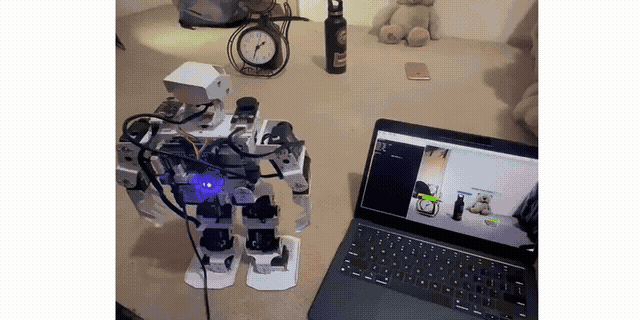
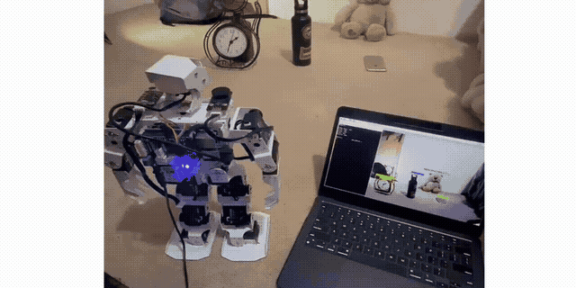

# TonyPiRobot

A PyQt5-based desktop application for robot control and management with AI-powered object detection using YOLO-light integration.

[](LICENSE)
[](https://www.python.org/)
[](https://www.riverbankcomputing.com/software/pyqt/)
[](https://www.raspberrypi.org/)

## Why This Project

TonyPiRobot was created to provide an intuitive and powerful interface for robot control and management. The integration of YOLO-light brings real-time object detection capabilities, enabling robots to understand and interact with their environment more intelligently.

## Standout Features

- **Modern GUI Interface**: Built with PyQt5 for a responsive and intuitive user experience
- **YOLO-light Integration**: Real-time object detection for enhanced robot perception
- **Web Engine Integration**: Embedded web browser capabilities for displaying web-based content
- **Network Communication**: Built-in network support for robot communication and data transfer
- **Positioning Services**: Location and positioning features for robot navigation
- **Cross-platform Ready**: Windows executable included, can be built for other platforms
- **Real-time Computer Vision**: Object detection and tracking for autonomous navigation

## Tech Stack

- **Python** 3.7+
- **PyQt5** - GUI framework
- **Qt5 WebEngine** - Embedded web browser
- **Qt5 Network** - Network communication
- **Qt5 Positioning** - Location services
- **YOLO-light** - Lightweight object detection
- **OpenCV** - Computer vision and image processing
- **netifaces** - Network interface management

## Architecture (Essential)

```
src/
├── main.py                 # Main application entry point
├── gui/
│   ├── main_window.py     # Primary GUI interface
│   ├── control_panel.py   # Robot control widgets
│   └── detection_view.py  # YOLO detection visualization
├── vision/
│   ├── yolo_detector.py   # YOLO-light integration
│   └── camera_handler.py  # Camera interface
├── network/
│   ├── robot_client.py    # Robot communication
│   └── discovery.py       # Network discovery
└── positioning/
    └── gps_handler.py     # Location services
```

## Quick Run

### Option 1: Using Pre-built Executable (Windows)

1. Download the latest release from the releases page
2. Extract the `main` folder
3. Run `main.exe` from the extracted folder

### Option 2: Running from Source

```bash
# Clone the repository
git clone https://github.com/yourusername/TonyPiRobot.git
cd TonyPiRobot

# Install dependencies
pip install PyQt5
pip install netifaces
pip install opencv-python
pip install numpy
pip install torch
pip install torchvision

# Run the application
python main.py
```

## Usage

Launch the application to access the robot control interface with integrated YOLO-light object detection. The application provides:

- **Robot Control Panel**: Direct control of robot movements and actions
- **Detection View**: Real-time object detection visualization
- **Network Dashboard**: Monitor and manage robot connections
- **Position Tracking**: GPS and location-based navigation

## Demo Videos

### Robot Detection in Action



[Full Video Demo](optics/robottt.mp4)

### Compact Demo



## Roadmap

Planned features and future improvements:

- [ ] Linux and macOS builds
- [ ] Enhanced YOLO models for better accuracy
- [ ] Real-time sensor data visualization
- [ ] Remote control capabilities via web interface
- [ ] Configuration management system
- [ ] Logging and debugging tools
- [ ] Multi-robot swarm control
- [ ] Advanced path planning algorithms

See the [open issues](https://github.com/yourusername/TonyPiRobot/issues) for a full list of proposed features (and known issues).

## Contributing

Contributions are what make the open source community such an amazing place to learn, inspire, and create. Any contributions you make are **greatly appreciated**.

1. Fork the Project
2. Create your Feature Branch (`git checkout -b feature/AmazingFeature`)
3. Commit your Changes (`git commit -m 'Add some AmazingFeature'`)
4. Push to the Branch (`git push origin feature/AmazingFeature`)
5. Open a Pull Request

## License

Distributed under the MIT License. See `LICENSE` for more information.

## Contact

Project Link: [https://github.com/yourusername/TonyPiRobot](https://github.com/yourusername/TonyPiRobot)
Personal Contact: [https://www.freyazou.com/contact/](https://www.freyazou.com/contact/)

## Acknowledgments

- [PyQt5](https://www.riverbankcomputing.com/software/pyqt/) - Python bindings for Qt5
- [Qt Framework](https://www.qt.io/) - Cross-platform application framework
- [YOLO](https://github.com/ultralytics/ultralytics) - Object detection framework
- [OpenCV](https://opencv.org/) - Computer vision library
- [Shields.io](https://shields.io/) - Badge generation
- [Choose an Open Source License](https://choosealicense.com/) - License guidance


